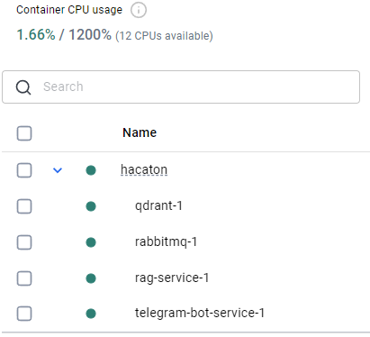
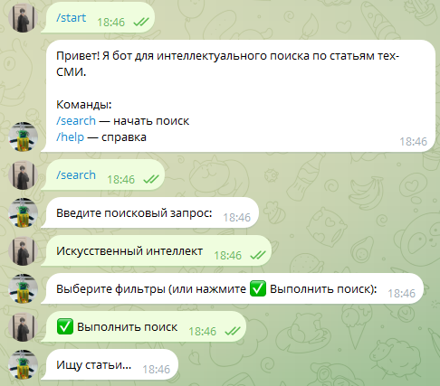
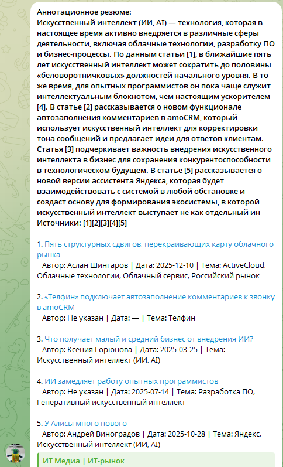
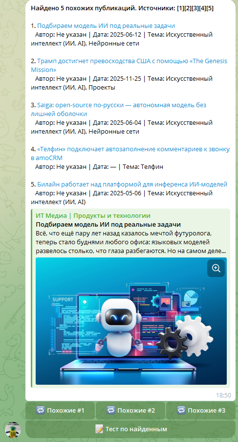
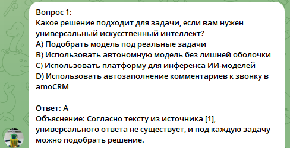

## 1. Docker Compose проекта

Проект разворачивается с использованием `docker compose` и состоит из следующих контейнеров:
- `rabbitmq` — брокер сообщений;
- `qdrant` — векторное хранилище;
- `indexer-service` — индексация CSV;
- `rag-service` — retrieval + LLM;
- `telegram-bot-service` — пользовательский интерфейс.

---

## 2. Модель

В качестве LLM была выбрана **Mistral 7B**.

Процесс подготовки модели:
1. Модель скачана с **Hugging Face**.
2. Выполнено преобразование весов в формат **GGUF** с использованием `llama.cpp`.
3. Полученный файл модели помещён в каталог `./models/`.
4. Модель монтируется внутрь контейнера `rag-service` и используется для:
   - генерации аннотационного резюме;
   - рекомендаций похожих статей;
   - генерации мини-квиза.

Формат **GGUF** выбран для локального инференса и снижения зависимости от внешних API.

---

## 3. Демонстрация работы сервиса

---

### 3.1 Поиск статей

Пользователь отправляет текстовый запрос через Telegram-бот.

Алгоритм:
- запрос пользователя;
- построение эмбеддинга;
- поиск ближайших документов в **Qdrant**;
- генерация ответа LLM;
- возврат краткого резюме с цитированием источников.

---

### 3.2 Похожие статьи

Функция рекомендаций основана на последнем пользовательском запросе.

Алгоритм:
- используется embedding запроса или топ-документа;
- выполняется similarity search в **Qdrant**;
- пользователю возвращается список релевантных публикаций.

---

### 3.3 Мини-квиз

Сервис поддерживает генерацию небольшого квиза по найденным материалам.

Алгоритм:
- вопросы формируются на основе retrieved-документов;
- используется тот же контекст, что и для генерации summary.

---